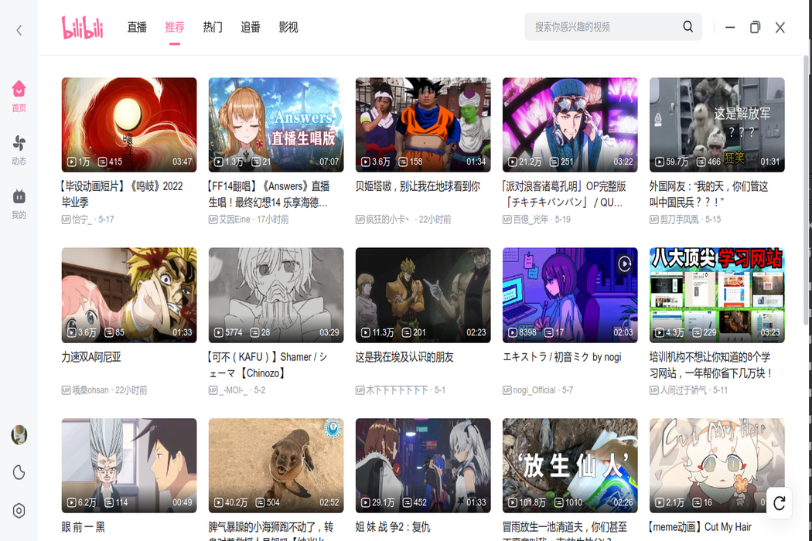
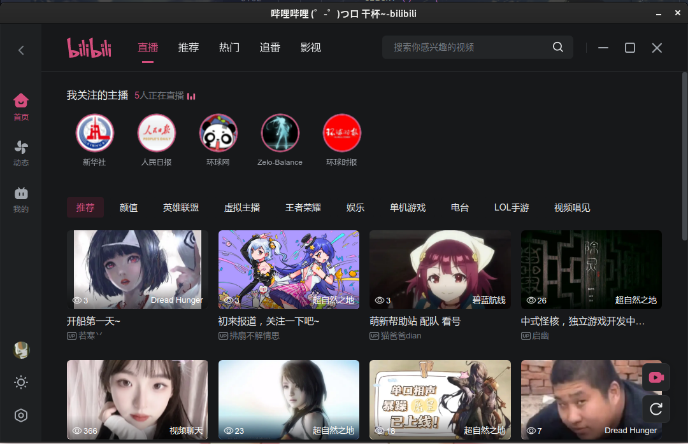
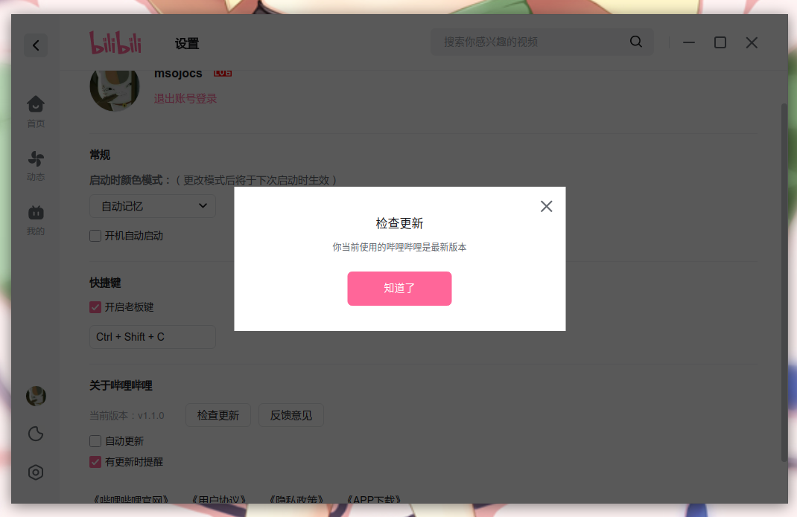
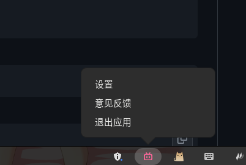
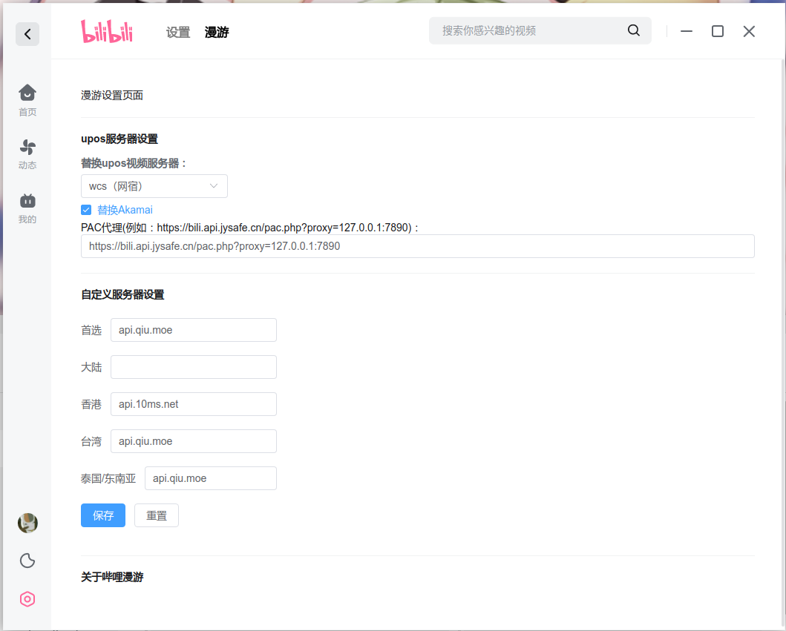

**简体中文 | [繁體中文](README_zh-tw.MD) | [English](README_en.MD)**

<div align="center">

  

  <h3>哔哩哔哩 Linux版</h3>
  <br>

----

[](https://aur.archlinux.org/packages/bilibili-bin)

  这是哔哩哔哩 Linux版
  
  SVG图标来自 [@Peternal](https://github.com/Peternal)

  <br>
</div>

## 介绍

本项目用到了：

1. 反混淆
2. 调试
3. 脑子

本项目完全开源，且没有任何代码加密操作，如有疑虑请自行审查代码或停止使用相关文件。

## 特点

1. 没有讨厌的标题栏
2. 支持小分辨率屏幕全屏
3. 检查更新支持
4. 有能够关闭程序的菜单
5. 支持漫游
6. 外区搜索
7. [弹幕共享](docs/help/弹幕共享.MD)

## 使用方法

### 自动化构建

请到 Release 页面下载：

https://github.com/msojocs/bilibili-linux/releases

即时构建版本：

https://github.com/msojocs/bilibili-linux/releases/tag/continuous

### 手动构建

1. 拉取代码
   ```
   git clone https://github.com/msojocs/bilibili-linux.git
   cd bilibili-linux
   ```
2. 安装
   ```
   tools/setup-bilibili.sh
   ```
3. 启动
   ```
   bin/bilibili
   ```
### AppImage 安装

请使用 [AppImageLauncher](https://github.com/TheAssassin/AppImageLauncher)

## macOS

macOS 版与 Linux、Windows 版共用同一套补丁与扩展。

### 构建

```bash
pnpm install
pnpm run build-mac
```

产物在 `tmp/build/`，含 x64 与 arm64 两个架构的 dmg 与 zip。

### 手动构建

```
tools/setup-bilibili-mac.sh
bin/bilibili-mac
```

### 安装

包是未签名，首次打开会被 Gatekeeper 拦：

```bash
xattr -dr com.apple.quarantine /Applications/bilibili.app
```

或在「系统设置 → 隐私与安全性」里点「仍要打开」。要分发给他人需用
`MAC_IDENTITY` 指定 Developer ID 证书并做公证。

### 已知限制

托盘图标未做 Template 适配；空降助手依赖
`faster_whisper` 与 `torch`，需自行安装。

## Gentoo Linux

Emerge from [gentoo-zh overlay](https://github.com/microcai/gentoo-zh/tree/master/media-video/bilibili).

### 额外补充

如果阁下不喜欢电脑多装一个 Electron，可以自行提取发布版的 `app.asar` 并使用已安装 Electron 启动，建议的 Electron 版本是：`43.1.1`（`VaapiOnNvidiaGPUs` 需要 Electron 43+ / Chromium 130+）

## GPU 加速配置

Electron 43 (Chromium 150) 支持 Linux 下 VA-API 硬件视频解码。以下为推荐配置：

### NVIDIA GPU

1. 安装 VA-API → NVDEC 后端：
   ```bash
   # Arch Linux
   sudo pacman -S libva-nvidia-driver
   # Debian/Ubuntu
   sudo apt install libva-nvidia-driver
   ```

2. 设置环境变量（libva 需要此变量定位 NVIDIA 后端）：
   ```bash
   export LIBVA_DRIVER_NAME=nvidia
   ```

3. 在 `~/.config/bilibili/bilibili-flags.conf` 中配置：

   ```
   --ignore-gpu-blocklist
   --enable-features=AcceleratedVideoDecodeLinuxGL,AcceleratedVideoDecodeLinuxZeroCopyGL,VaapiOnNvidiaGPUs,VaapiIgnoreDriverChecks,PlatformHEVCDecoderSupport
   --enable-gpu-rasterization
   --enable-zero-copy
   --disable-gpu-sandbox
   ```

   > **说明**：
   > - `VaapiOnNvidiaGPUs` (Chromium 130+) 绕过 vaapi_wrapper 对 NVIDIA 设备的跳过检查
   > - `AcceleratedVideoDecodeLinuxGL` / `AcceleratedVideoDecodeLinuxZeroCopyGL` 为 Chromium 150 推荐的 GL 零拷贝解码路径
   > - Electron 28 不支持以上 feature，NVIDIA 视频硬解需要 Electron 43+

### Intel / AMD GPU

```
--ignore-gpu-blocklist
--enable-features=AcceleratedVideoDecodeLinuxGL,AcceleratedVideoDecodeLinuxZeroCopyGL,VaapiVideoDecoder,VaapiIgnoreDriverChecks,PlatformHEVCDecoderSupport
--enable-gpu-rasterization
--enable-zero-copy
--disable-gpu-sandbox
```

Intel 核显与 AMD 独显/核显使用 Mesa VA-API 后端，无需额外安装驱动或设置环境变量。

### 验证硬解

播放视频后检查 GPU 解码引擎是否工作：

```bash
cat /proc/$(pgrep -f "type=gpu-process.*bilibili")/fdinfo/* | grep drm-engine-video
```

非零数值表示 GPU 解码引擎正在工作。也可访问 `chrome://gpu` 查看 "Video Decode" 状态。

### 注意

- `--use-gl=angle --use-angle=gl` 在部分 Linux 桌面环境（尤其是 Wayland）下可能导致 VA-API 解码失效，建议使用 Electron 默认的 EGL/GLX 后端。
- 如果系统开启了代理（如 Clash），`bilipc.bilibili.com` 经代理可能无法解析导致白屏。Electron 43+ 版本已内置代理绕过处理。

## 开发者工具

### F12 开发者面板

现已支持自行打开开发者工具，方法如下：

现已支持自行打开开发者工具，方法如下：

尝试按下<kbd>F12</kbd>，如果没有反应就是没有开启；

登录界面有两层，内层右键打开，外层<kbd>F12</kbd>打开。

## 关于龙芯

https://areweloongyet.com/docs/loong-or-loongarch

|发行版|架构标识符|
|------|----------|
|AOSC OS|`loongarch64`|
|Debian|<ul><li>旧世界：`loongarch64`</li><li>新世界：`loong64`</li></ul>|
|Gentoo|`loong`|
|Loong Arch Linux|`loong64`|
|RPM 系|`loongarch64`|
|Slackware|`loong64`|

## 空降助手

自动帮助阁下空降至关键位置。

你需要提前安装`python3`软件包与`faster_whisper` `torch`模块。

参考文档：[AiTranscribe](docs/AiTranscribe.MD)

| 选项 | 说明 |
|------|-----|
| Whisper代理 | 模型下载需要代理, 形如：`http://127.0.0.1:1080` |
| LD_LIBRARY_PATH | 可能遇到 `cudnn` 库找不到，[参考此处](https://github.com/MahmoudAshraf97/whisper-diarization/issues/259) |
| AI识别TOKEN | https://www.bigmodel.cn/ 的Token，使用免费模型 `glm-4.5-flash` |

## 切换语言

1. 在主页点击右下角设定按钮
2. 进入“其它设定”
3. 在“语言设定”区域选择你想要的语言

## 更新日志

[CHANGELOG.md](CHANGELOG.md)

## 预览











## 感谢以下项目

1. [BiliRoaming](https://github.com/yujincheng08/BiliRoaming)
2. [解除B站区域限制](https://github.com/ipcjs/bilibili-helper)
3. [小电视空降助手](https://github.com/hanydd/BilibiliSponsorBlock)

## 免责声明

License 仅对本项目生效，不针对其产物。

哔哩哔哩客户端版权归上海宽娱数码科技有限公司所有；

对于使用本项目产生的额外问题，如账户封禁被盗等，维护者不对此负责，请谨慎使用；

如有不当之处，请联系本人，邮箱：jiyecafe@gmail.com
