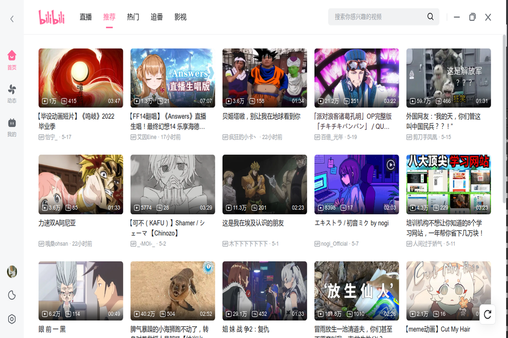
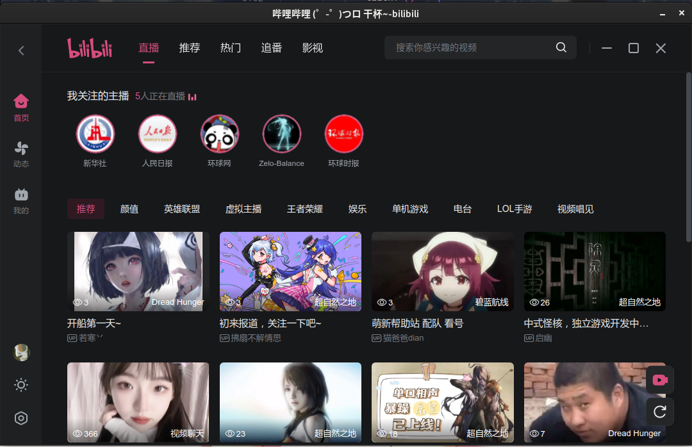
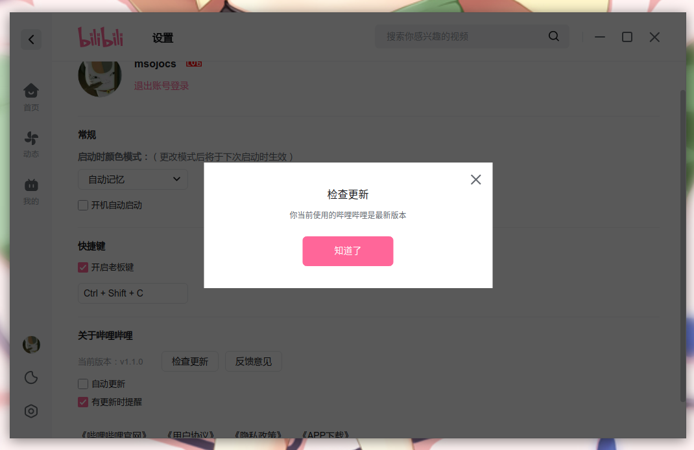
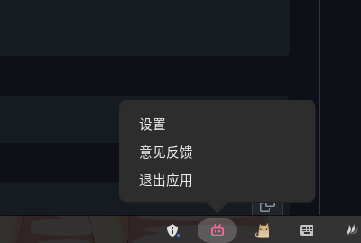
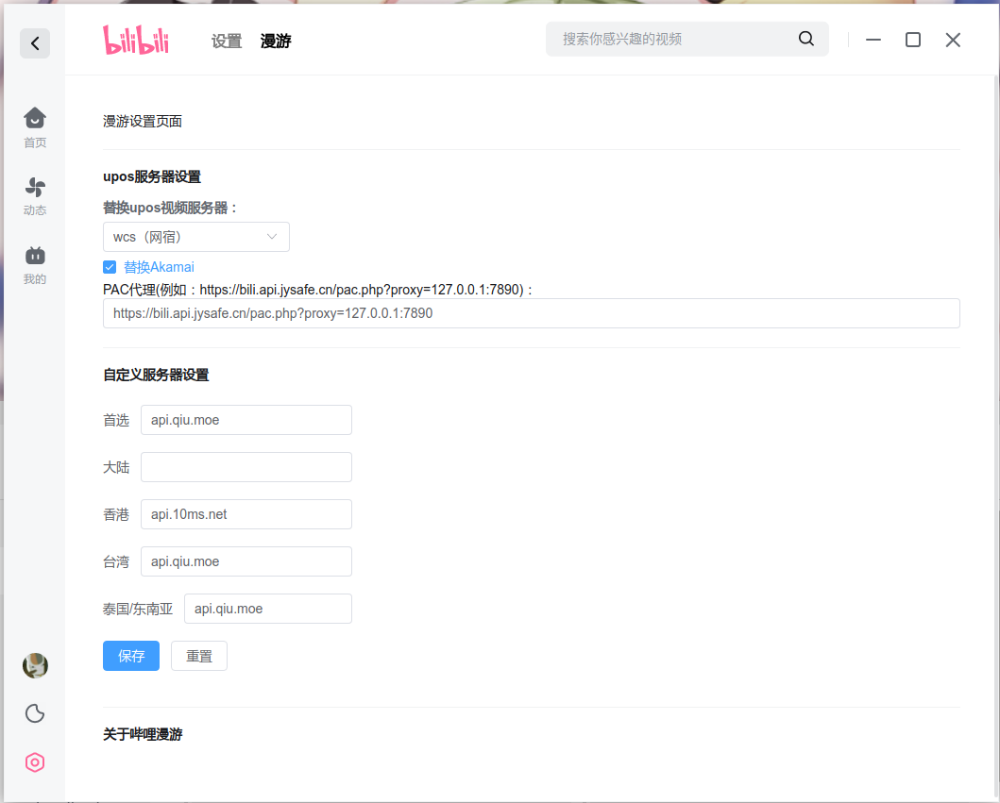

> [!NOTE]
> 本檔案由 AI 產生

**[简体中文](README.MD) | 繁體中文 | [English](README_en.MD)**

<div align="center">

  

  <h3>嗶哩嗶哩 Linux版</h3>
  <br>

----

[](https://aur.archlinux.org/packages/bilibili-bin)

  這是嗶哩嗶哩 Linux版

  SVG圖示來自 [@Peternal](https://github.com/Peternal)

  <br>
</div>

## 介紹

本專案用到了：

1. 反混淆
2. 調試
3. 腦子

本專案完全開源，且沒有任何程式碼加密操作，如有疑慮請自行審查程式碼或停止使用相關檔案。

## 特點

1. 沒有討厭的標題列
2. 支援小解析度螢幕全螢幕
3. 檢查更新支援
4. 有能夠關閉程式的選單
5. 支援漫遊
6. 外區搜尋
7. [彈幕共享](docs/help/弹幕共享.MD)

## 使用方法

### 自動化建構

請到 Release 頁面下載：

https://github.com/msojocs/bilibili-linux/releases

即時建構版本：

https://github.com/msojocs/bilibili-linux/releases/tag/continuous

### 手動建構

1. 拉取程式碼
   ```
   git clone https://github.com/msojocs/bilibili-linux.git
   cd bilibili-linux
   ```
2. 安裝
   ```
   tools/setup-bilibili
   ```
3. 啟動
   ```
   bin/bilibili
   ```
### AppImage 安裝

請使用 [AppImageLauncher](https://github.com/TheAssassin/AppImageLauncher)

## Gentoo Linux

Emerge from [gentoo-zh overlay](https://github.com/microcai/gentoo-zh/tree/master/media-video/bilibili).

### 額外補充

如果閣下不喜歡電腦多裝一個 Electron，可以自行提取發行版的 `app.asar` 並使用已安裝 Electron 啟動，建議的 Electron 版本是：`28.2.1`

## Flag參數配置

支援的參數列表：
https://www.electronjs.org/docs/latest/api/command-line-switches

1. 建立 `flags` 檔案

   在 `~/.config/bilibili` 目錄下建立 `bilibili-flags.conf` 檔案

2. 填寫配置

   ```
   --disable-gpu
   --key=value
   ```

## 開發者工具

現已支援自行打開開發者工具，方法如下：

嘗試按下<kbd>F12</kbd>，如果沒有反應就是沒有開啟；

登入介面有兩層，內層右鍵打開，外層<kbd>F12</kbd>打開。

## 關於龍芯

https://areweloongyet.com/docs/loong-or-loongarch

|發行版|架構識別碼|
|------|----------|
|AOSC OS|`loongarch64`|
|Debian|<ul><li>舊世界：`loongarch64`</li><li>新世界：`loong64`</li></ul>|
|Gentoo|`loong`|
|Loong Arch Linux|`loong64`|
|RPM 系|`loongarch64`|
|Slackware|`loong64`|

## 空降助手

自動幫助閣下空降至關鍵位置。

| 選項 | 說明 |
|------|-----|
| Whisper代理 | 模型下載需要代理 形如：`http://127.0.0.1:1080` |
| LD_LIBRARY_PATH | 可能遇到 `cudnn` 庫找不到，[參考此處](https://github.com/MahmoudAshraf97/whisper-diarization/issues/259) |
| AI識別TOKEN | https://www.bigmodel.cn/ 的Token，使用免費模型 `glm-4.5-flash` |

## 切換語言

1. 在主頁點擊右下角設定按鈕
2. 進入“其它設定”
3. 在“語言設定”區域選擇你想要的語言

## 更新日誌

[CHANGELOG.md](CHANGELOG.md)

## 預覽











## 感謝以下專案

1. [BiliRoaming](https://github.com/yujincheng08/BiliRoaming)
2. [解除B站區域限制](https://github.com/ipcjs/bilibili-helper)
3. [小電視空降助手](https://github.com/hanydd/BilibiliSponsorBlock)

## 免責聲明

License 僅對本專案生效，不針對其產物。

嗶哩嗶哩客戶端版權歸上海寬娛數碼科技有限公司所有；

對於使用本專案產生的額外問題，如帳戶封禁被盜等，維護者不對此負責，請謹慎使用；

如有不當之處，請聯繫本人，信箱：jiyecafe@gmail.com