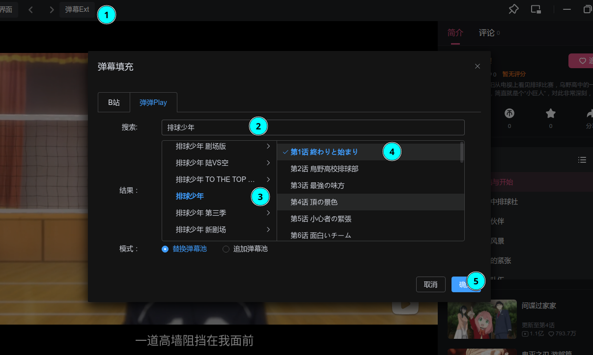

# 弹幕共享

弹幕共享是什么？

弹幕共享是一个提供不同区域弹幕互通的服务。

## 场景

你在港澳台或东南亚观看某一部番剧，而它的弹幕少的可怜，同时你在没有弹幕的情况下对此番提不起兴趣；

于是，你想：“可不可以把其它地方的弹幕调过来用？”

> 为什么要调过来？
> 1. 其它地方可能画质欠佳
> 2. 其它地方可能加载视频缓慢
> 3. 其它地方可能没有视频资源

## 食用栗子

### 排球少年

无弹幕：

搜索：

有弹幕：

