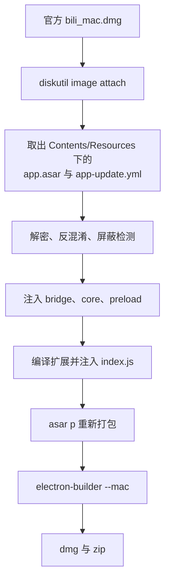

# macOS 打包设计

## 结论

macOS 版与 Linux、Windows 共用同一套补丁流程和扩展，差别只在应用来源。应用本体从官方 macOS 安装包（dmg）取，不复用 Windows 安装包解出的 `app.asar`。

```bash
pnpm run build-mac
```

产物在 `tmp/build/`，含 x64 与 arm64 两个架构的 dmg 与 zip。

## 为什么 macOS 要单独取源

`tools/update-bilibili.sh` 从 `bili_win-install.exe` 解出 `resources/app.asar`。asar 内置 nut.js 等原生模块，nut.js 把三个平台的预编译一起打进包，运行时按平台挑：

| 平台 | 包内文件 |
| --- | --- |
| macOS | `libnut-darwin.node`（universal）、`mission-control/dist/{arm64,x64}/addon.node`、`node-mac-permissions` |
| Linux | `libnut-linux.node`、ELF 版 mission-control |
| Windows | `libnut-win32.node`、PE 版 mission-control、`main/setfta.exe`、`keep-pc-alive` |

`node-mac-permissions` 是 macOS 专属模块，用于申请辅助功能权限。Windows 包里没有 Mach-O 模块，在 macOS 上加载会失败，所以 macOS 需要从官方 dmg 单独取源。

## 流程



取源之后产出的目录结构与 Windows 源一致，因此 `tools/fix-other.sh` 与 `tools/extension.sh` 都能直接复用。

## 改动清单

### 新增

| 文件 | 作用 |
| --- | --- |
| `tools/update-bilibili-mac.sh` | 挂载 dmg，取出 `tmp/bili/resources/` 下的 `app.asar` 与 `app-update.yml` |
| `tools/setup-bilibili-mac.sh` | 编排全流程，装依赖、取源、打补丁、构建扩展 |
| `bin/bilibili-mac` | 本地调试启动器。Electron 在 macOS 上是 .app，可执行文件位于 `Contents/MacOS` |

### 修改

`tools/fix-other.sh` 按 `BILIBILI_TARGET_PLATFORM`（默认 `linux`）分支三处：

- `sed -i` 改为 `sed -i.bak`，打完删掉备份文件。BSD sed 的 `-i` 必须带后缀参数，GNU sed 下 `-i.bak` 行为一致，这样两边都能跑。
- `if (!jT` 只出现在 Windows 包的反混淆产物里，macOS 跳过。
- `cursor-tool` 用于读取鼠标坐标，走的是 Linux 输入子系统，macOS 不生成。

`src/inject/common/electron-tool.ts`：

- `app/getInitInfo` 的平台标记只在 macOS 上分叉，Linux 与 Windows 的取值固定不变。官方主代码据此选择窗口样式等行为，macOS 上取值不对会让窗口走错分支。
- 空降助手 spawn `transcribe.py` 时，动态库搜索路径按平台选 `DYLD_LIBRARY_PATH` 或 `LD_LIBRARY_PATH`。
- `sw_vers` 的伪造只在 macOS 以外生效。macOS 上它是真实命令，伪造会让按系统版本分支的逻辑取到错值。

`conf/config.json` 增加 `darwin-x64` 与 `darwin-arm64`，供 `tools/update-electron.sh --arch darwin-*` 本地调试下载 electron。打包时 electron 由 electron-builder 自行下载。

`conf/build.json` 的 `mac` 节点补 `category` 与 `artifactName`。产物名带上 `macos` 与架构，否则 `bilibili-1.19.0-x64.zip` 与 Linux 的 `bilibili-v1.19.0-4-x64.tar.gz` 从名字上分不出平台，双架构产物也会同名。

`package.json` 新增 `setup-mac` 与 `build-mac`，`pkg-mac` 改出双架构。签名身份通过 `MAC_IDENTITY` 环境变量传入，默认 `null` 出未签名包，有证书时设置该变量即可，无需改配置。

`.github/workflows/release.yml` 新增 `build-mac` job。它不复用 `build-app` 的产物，那个 job 在 Linux 上从 Windows 安装包取源，asar 里的原生模块是 PE/ELF。macOS runner 的计费倍率远高于 Linux，且整套流程要重新下载 dmg 打补丁，因此该 job 只在发版时触发。

## 取源注意事项

- 官方 CDN 会拒绝 curl 的默认 User-Agent，脚本里伪装成浏览器。
- dmg 内的 app 名是中文，脚本按 `Contents/Resources/app.asar` 定位，不写死 app 名。
- dmg 是只读挂载，无论成功失败都要卸载，否则挂载点会残留占用。
- 官方 macOS 包与 Windows 包的构建号可能不同。脚本只严格比对版本前三段，构建号不一致时给出提示继续。

## 已知限制

- 包未签名，首次打开需执行 `xattr -dr com.apple.quarantine`。分发给他人需要 Apple Developer ID 证书并做公证。
- 托盘图标没有做 macOS 的 Template 命名适配，深色菜单栏下可能看不清。
- 空降助手依赖 `faster_whisper` 与 `torch`，macOS 上需自行安装。